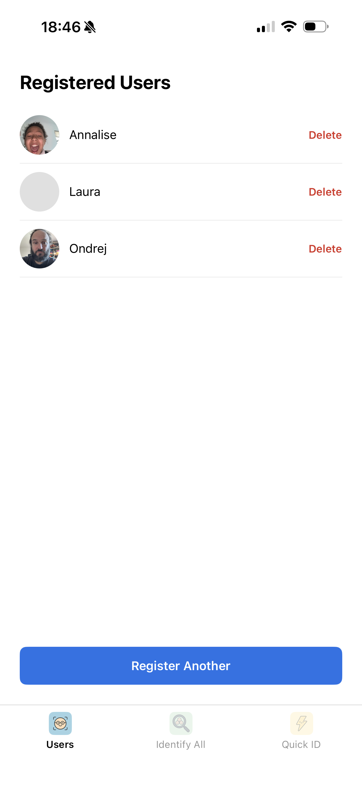
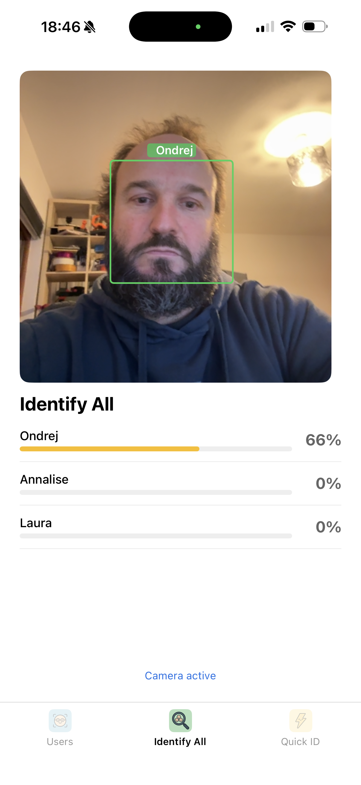
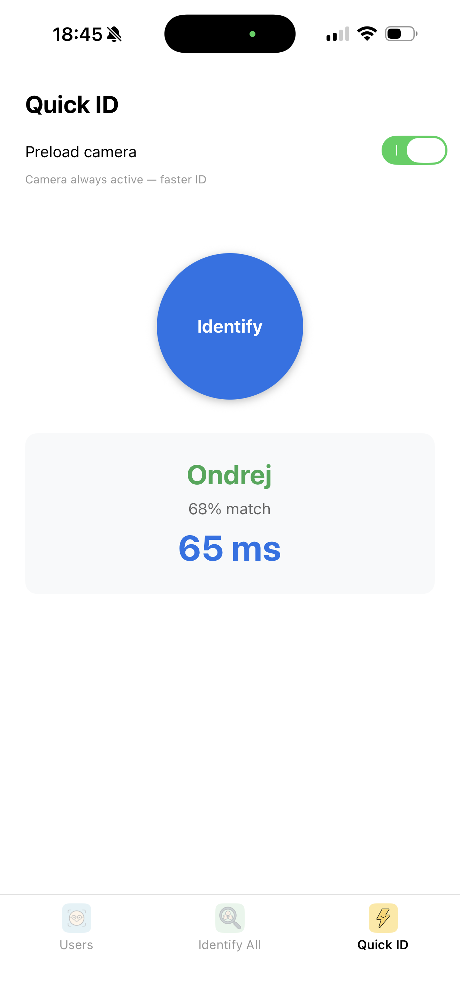

<p align="center">
  
</p>

# Faces

Cross-platform face identification library for in-app multi-user authentication.

Identifies users by face in under 300ms. Runs entirely on-device — no cloud.

## Screenshots

| Users | Identify All | Quick ID |
|:-----:|:------------:|:--------:|
|  |  |  |

---

## Structure

```
ios/        Swift Package — FacesKit (Vision, CoreML, AVFoundation)
android/    Gradle library — faceskit AAR (CameraX, ML Kit, TFLite)
react/      React Native module — react-native-faces (TurboModules)
examples/   Three standalone RN apps (registration, recognition, debug)
model/      Training pipeline — train your own CoreML + TFLite model
docs/       Architecture, testing, training guide
```

The model is **not included**. Everyone trains their own from a dataset of their choice. See [Training](#training) below.

---

## How it works

```
Register user (6 guided photos)
    → detect face → extract 128-dim embedding → store on device

Live camera frame (every 3rd frame)
    → detect face → extract embedding → cosine similarity vs. stored embeddings
    → if score > 0.70 → emit login event
```

Identification, not authentication. Speed over security.

The guided registration UX for the example app is defined in
`docs/registration-guided-capture.md`.

---

## Quick start

### iOS

Add to your `Package.swift`:

```swift
.package(url: "https://github.com/UnlikeOtherAI/Faces.git", from: "0.1.0"),
```

```swift
import FacesKit

FacesKit.shared.onMatch = { match in
    login(userId: match.worker.id)
}
FacesKit.shared.start()
```

### Android

```kotlin
// build.gradle.kts
implementation("ai.unlikeother:faceskit:0.1.0")
```

```kotlin
FacesKit.onMatch = { match -> login(match.worker.id) }
FacesKit.start(context)
```

### React Native

```bash
pnpm add react-native-faces
```

```typescript
import FaceID from 'react-native-faces'

FaceID.startRecognition()
FaceID.onFaceRecognized((match) => login(match.workerId))
```

---

## Training

The model must be trained before the library works. You provide a face dataset; the pipeline produces a CoreML model for iOS and a TFLite model for Android.

### Setup

```bash
cd model
python3 -m venv .venv && source .venv/bin/activate
pip install -r requirements.txt
```

### Choose a dataset

| Dataset | Identities | Images | Notes |
|---------|-----------|--------|-------|
| [DigiFace-1M](#digiface-1m-recommended) | 10,006 | 1.2M | **Recommended** — fully synthetic, zero privacy issues, pre-aligned, scriptable download |
| [Glint360K](#glint360k) | 360,000 | 17M | Best accuracy, industry standard, scraped from web |
| [MS1MV3](#ms1mv3) | 93,000 | 5.9M | Cleaned MS-Celeb, widely used, scraped from web |
| [VGGFace2](#vggface2) | 9,131 | 3.3M | Good pose/age diversity, requires registration |
| [CASIA-WebFace](#casia-webface) | 10,575 | 494k | Smallest, good for quick experiments, scraped from web |

All "scraped from web" datasets carry privacy and consent concerns — images were collected without subject knowledge. Be aware of this for commercial products.

---

### DigiFace-1M (recommended)

Fully synthetic — Microsoft Research. No real people. Zero privacy concerns.

LFW accuracy after training: ~99.0–99.2%

```bash
# Download (~14 GB, resumable)
python model/dataset/download_synthetic.py --dst data/raw

# Validate and prepare
python model/dataset/prepare_synthetic.py --src data/raw --dst data/aligned

# Train
python model/train.py --data data/aligned --epochs 40 --batch 128 --output checkpoints/
```

---

### Glint360K

Best accuracy. Available via the InsightFace project.

1. Download from [InsightFace dataset page](https://github.com/deepinsight/insightface/tree/master/recognition/arcface_torch#ms1mv3)
2. Extract to `data/raw/` (one folder per identity)
3. Align with MTCNN:

```bash
pip install facenet-pytorch
python model/dataset/prepare_real.py --src data/raw --dst data/aligned
python model/train.py --data data/aligned --epochs 30 --batch 256 --output checkpoints/
```

LFW accuracy: ~99.6–99.8%

**Note:** Scraped from the web. Use with appropriate legal review for commercial products.

---

### MS1MV3

Cleaned version of MS-Celeb-1M. Widely used in research.

1. Download from [InsightFace releases](https://github.com/deepinsight/insightface/tree/master/recognition/arcface_torch)
2. Convert from MXNet RecordIO format:

```bash
# Requires: pip install mxnet
python model/dataset/convert_mxnet.py --rec data/ms1mv3/train.rec --dst data/raw/
python model/dataset/prepare_real.py  --src data/raw --dst data/aligned
python model/train.py --data data/aligned --epochs 35 --batch 256 --output checkpoints/
```

LFW accuracy: ~99.4–99.7%

**Note:** Microsoft took the original MS-Celeb dataset down in 2019 due to privacy concerns. MS1MV3 is a cleaned re-release. Same caveats apply.

---

### VGGFace2

Excellent pose and age diversity. Requires registration.

1. Register and download from [VGGFace2 website](https://www.robots.ox.ac.uk/~vgg/data/vgg_face2/)
2. Extract to `data/raw/`
3. Align:

```bash
python model/dataset/prepare_real.py --src data/raw --dst data/aligned --min-images 10
python model/train.py --data data/aligned --epochs 40 --batch 128 --output checkpoints/
```

LFW accuracy: ~99.0–99.3%

---

### CASIA-WebFace

Smallest dataset. Good for quick experiments and testing the pipeline.

1. Download from academic sources (search "CASIA-WebFace download")
2. Align:

```bash
python model/dataset/prepare_real.py --src data/raw --dst data/aligned
python model/train.py --data data/aligned --epochs 40 --batch 128 --output checkpoints/
```

LFW accuracy: ~98.5–99.0%

---

### Validate

```bash
# Download LFW for validation
# http://vis-www.cs.umass.edu/lfw/lfw-funneled.tgz  → data/lfw_aligned/
# http://vis-www.cs.umass.edu/lfw/pairs.txt          → data/lfw_pairs.txt

python model/validate.py \
  --checkpoint checkpoints/epoch_040.pt \
  --lfw data/lfw_aligned
```

---

### Export models

```bash
# ONNX
python model/export/to_onnx.py \
  --checkpoint checkpoints/epoch_040.pt \
  --output model.onnx

# CoreML — drops into ios/ automatically
python model/export/to_coreml.py \
  --onnx model.onnx \
  --output ios/Sources/FacesKit/Resources/MobileFaceNet.mlpackage

# TFLite — drops into android/ automatically
python model/export/to_tflite.py \
  --onnx model.onnx \
  --output android/src/main/assets/mobilefacenet.tflite
```

After export, rebuild the iOS and Android projects — the model is bundled as a resource.

---

## Performance targets

| Metric | Target |
|--------|--------|
| Face detect | < 80ms |
| Embedding | < 120ms |
| Matching (100 users) | < 20ms |
| Total pipeline | < 300ms |
| CPU usage | < 40% |

---

## Example apps

Three example apps in `examples/` demonstrate the full workflow. See [docs/testing.md](docs/testing.md) for E2E test instructions using AppReveal.

---

## License

MIT — see [LICENSE](LICENSE).

Training datasets have their own licenses. Check each dataset's terms before commercial use.
